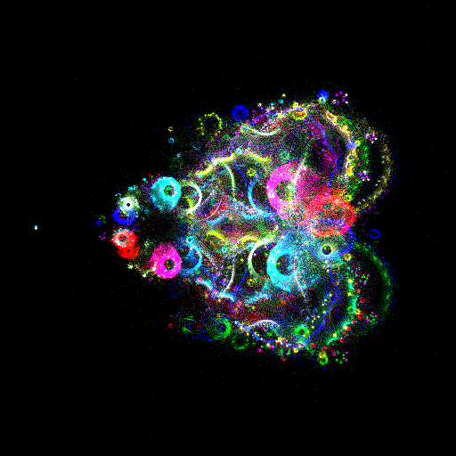
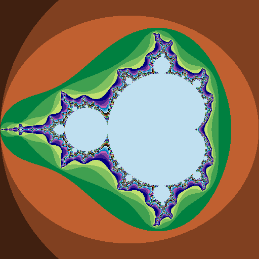

# Fractals
Playing around with cool fractals

### Buddhabrot

<!--  -->
####Quick Usage:
````
b = Buddhabrot()
b.render()
b.draw(<file_name>)
````
*Note: Because of the non-uniform densities of buddhabrot traces, I had to do some use a clever coloring to get this drawing to show up nicely. If you use the default color function (the same one that colored the mandelbrot and julia images below),
you'll end up with something like this:*


The function I used:
````
def buddha_color(i):
  r= int(255 * math.atan(float(i)/ 10))
  return (r, r, r)
````
### Mandelbrot

####Quick Usage:
````
m = Mandelbrot()
m.render()
m.draw(<file_name>)
````
<!-- #### Parameters
mandel0.png - Normal algorithm
mandel1.png - After some tweaks
mandel2.png - Bitshifted colors
mandel3.png - Bitshifted colors; Threshold 10.0
mandel4.png - Threshold 10.0
madnel5.png - Threshold 0.1
mandel6.png - Threshold 100.0 -->

### Julia

####Quick Usage:
````
j = Julia()
j.render()
j.draw(<file_name>)
````
